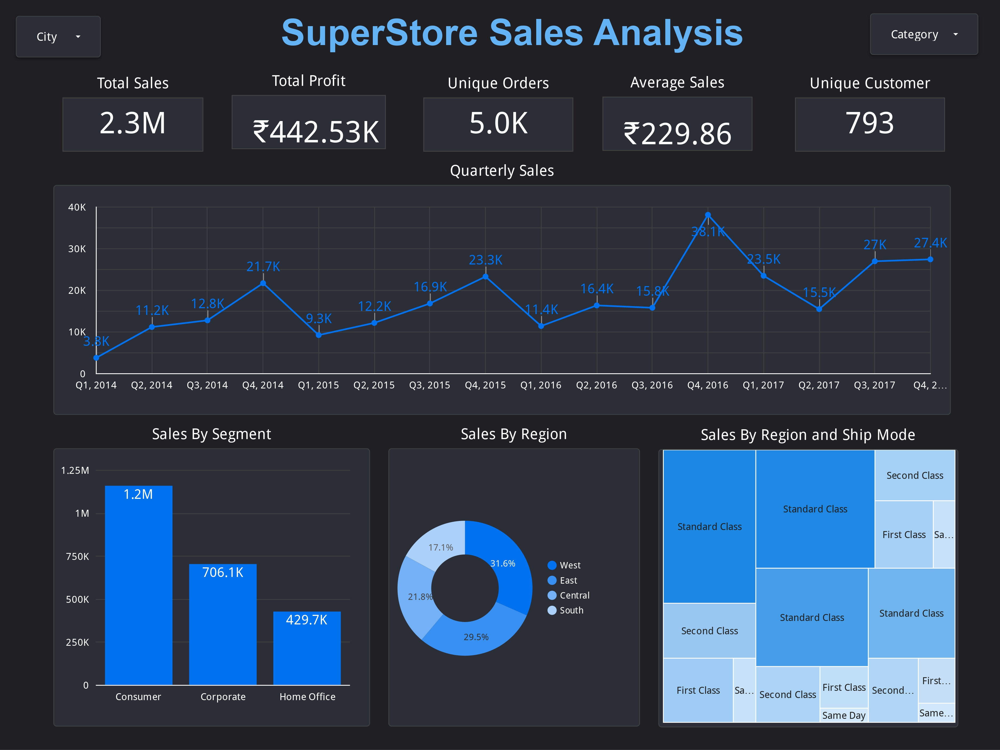
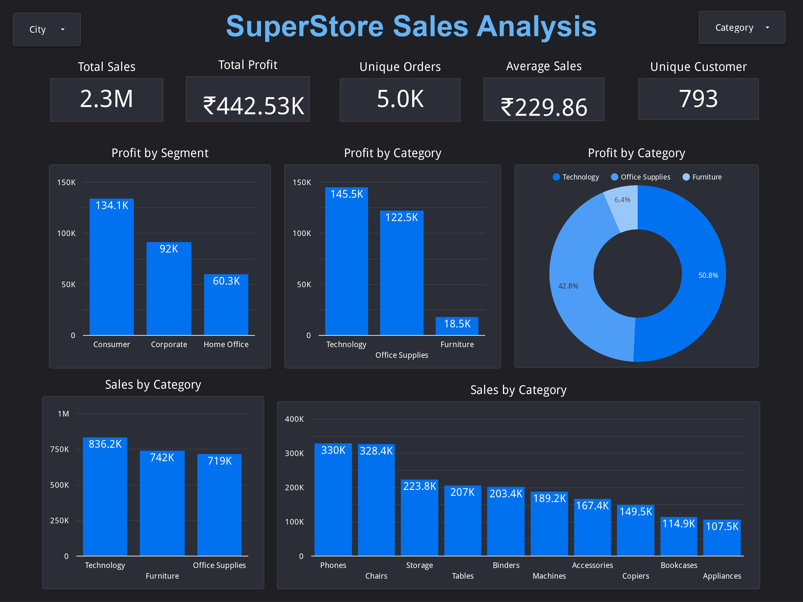

# Superstore Sales Analysis

## Table of Contents
1. [Problem Statement](#problem-statement)  
2. [Stakeholders](#stakeholders)  
3. [KPI’s (Key Performance Indicators)](#kpis-key-performance-indicators)  
4. [Recommended Analysis](#recommended-analysis)  
5. [Conclusion](#conclusion)  
6. [Portfolio & LinkedIn](#portfolio--linkedin)  
7. [License](#license)  

---

## Problem Statement
ShipFast Logistics is facing challenges with shipment delays and rising shipping costs, affecting customer satisfaction and profitability. As a data analyst, your task is to analyze shipment data to identify patterns, reduce delays, and optimize costs to improve delivery times and overall operational efficiency.

## Stakeholders
**Internal Stakeholders:**
- Logistics Team
- Finance Department
- Customer Service Team

**External Stakeholders:**
- Customers
- Shipping Partners

## KPI’s (Key Performance Indicators)
- **Total Sales:** 2.3M
- **Total Profit:** ₹442.53K
- **Total Orders:** 5000
- **Avg Sales:** ₹229.86
- **Total Customers:** 783

## Recommended Analysis
1. **Q1:** Find the Quarterly Sales.
2. **Q2:** Calculate Total Sales in Each Segment.
3. **Q3:** Calculate Total Sales in Each Region.
4. **Q4:** Calculate Total Sales by Region and Payment Mode.

## Conclusion
The analysis will provide valuable insights into shipment data, enabling ShipFast Logistics to make data-driven decisions to enhance delivery efficiency and reduce costs, ultimately improving customer satisfaction and profitability.

## Portfolio & LinkedIn
- [My Portfolio](https://peerlist.io/kunalmalviya06)
- [LinkedIn Profile](https://www.linkedin.com/in/kunal-malviya-0b6340289/details/skills/)

## License
This project is licensed under the MIT License.

---
